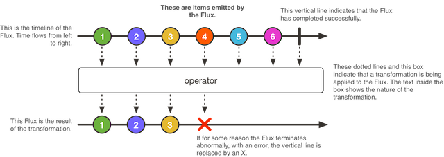

Flux<T> 是一个能够发出 0 到 N 个元素的标准的 Publisher<T>，它会被一个“错误（error）” 或“完成（completion）”信号终止。\
因此，一个 flux 的可能结果是一个 value、completion 或 error。 就像在响应式流规范中规定的那样，\
这三种类型的信号被翻译为面向下游的 onNext，`onComplete`和`onError`方法。

由于多种不同的信号可能性，Flux 可以作为一种通用的响应式类型。\
注意，所有的信号事件， 包括代表终止的信号事件都是可选的：\
如果没有 onNext 事件但是有一个 onComplete 事件， \
那么发出的就是 空的 有限序列，\
但是去掉 onComplete 那么得到的就是一个 无限的 空序列。 \
当然，无限序列也可以不是空序列，比如，Flux.interval(Duration) 生成的是一个 Flux<Long>， \
这就是一个无限地周期性发出规律 tick 的时钟序列。
