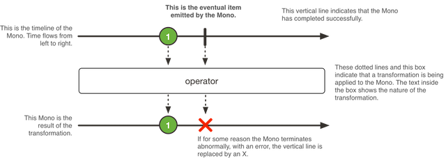

Mono<T> 是一种特殊的 Publisher<T>， 它最多发出一个元素，然后终止于一个 onComplete 信号或一个 onError 信号。

它只适用其中一部分可用于 Flux 的操作。比如，（两个 Mono 的）结合类操作可以忽略其中之一 而发出另一个
Mono，也可以将两个都发出，对于后一种情况会切换为一个 Flux。

例如，Mono#concatWith(Publisher) 返回一个 Flux，而 Mono#then(Mono) 返回另一个 Mono。

注意，Mono 可以用于表示“空”的只有完成概念的异步处理（比如 Runnable）。这种用 Mono<Void> 来创建。
